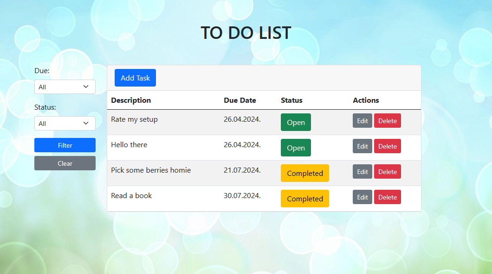
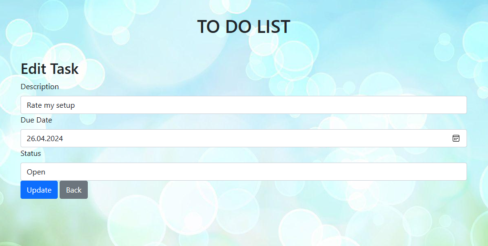
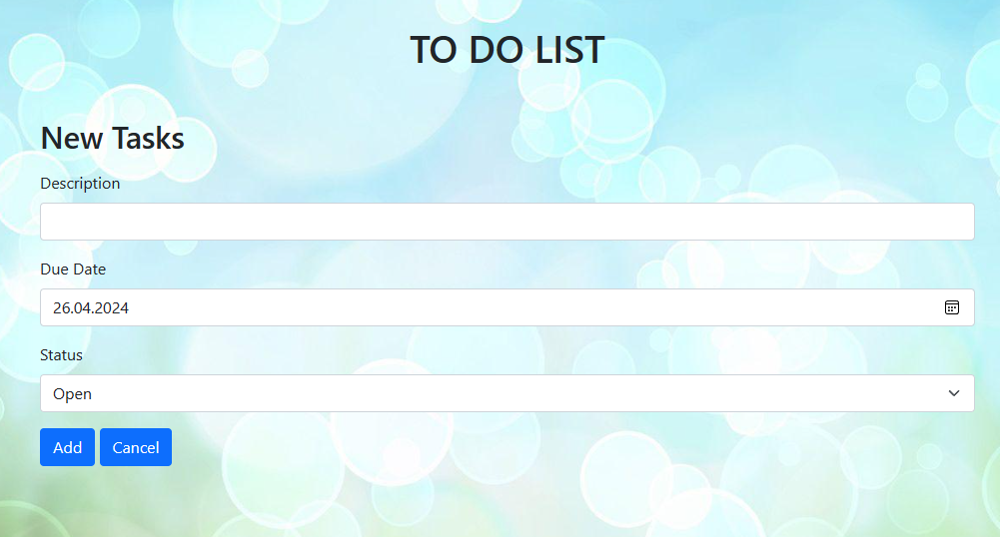
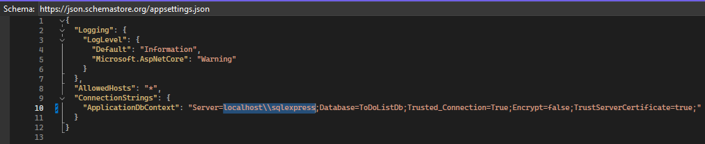
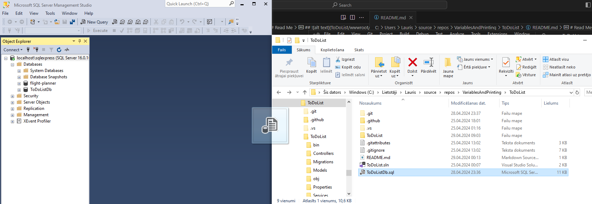

# Read Me

---

### Main preview

### Edit preview

---

## 

### Add preview

---

---

# To Start the program:

1. Change server location to your path in "appsettings.json" file
   

2. Drag(export) the database file "ToDoListDb.sql" into your database manager.
   
3. Run the project.
